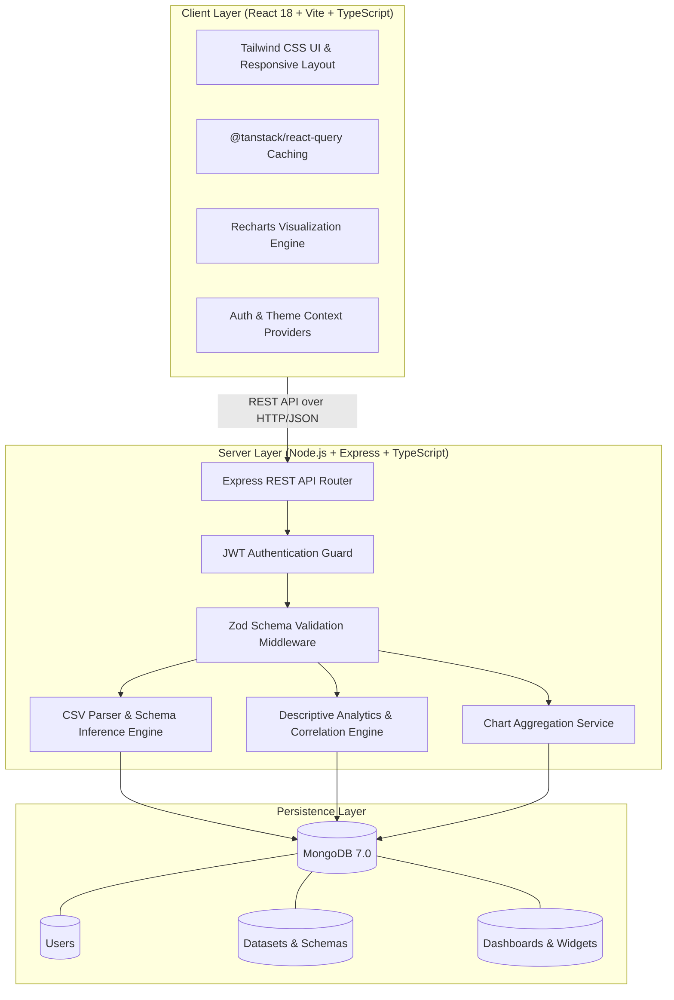

# InsightHub 📊

[](https://nodejs.org)
[](https://react.dev)
[](https://www.typescriptlang.org/)
[](https://vitejs.dev/)
[](https://tailwindcss.com/)
[](https://www.mongodb.com/)
[](LICENSE)

**InsightHub** is a production-grade, collaborative data analytics dashboard platform built with the MERN stack (MongoDB, Express, React, Node.js) and TypeScript. It enables users to upload CSV files, automatically profile datasets with descriptive statistics and Pearson correlations, generate interactive visualizations (Bar, Line, Area, Pie/Donut, Scatter), assemble customizable dashboards with drag-and-reorder controls, and publish public read-only views via shareable links.

---

## 🚀 Key Features

- **🔐 Robust JWT Authentication**: Register, login, password hashing with bcrypt, protected route guards, and 1-click **Instant Demo Account** access.
- **📁 Automated CSV Profiling & Schema Inference**:
  - Ingestion with file validation and type detection (numeric, string, boolean, date).
  - Descriptive statistics: min, max, mean/average, median, standard deviation, sum, null/missing counts.
  - Categorical frequency distributions and top value breakdowns.
  - Pairwise Pearson correlation matrix for numeric features.
  - Paginated preview data table with multi-column sorting and instant search.
- **🧹 Interactive Data Cleaning Studio**:
  - Automated data quality anomaly detection & alerts.
  - **1-Click Smart Auto-Clean**: automatic deduplication, string trimming, and median/mode null imputation.
  - **Missing Value Imputation**: Mean, Median, Mode, Constant value, or Row Drop.
  - **Deduplication**: Remove exact duplicate records or key-based duplicates.
  - **Outlier Detection & Filtering**: Statistical IQR (1.5x) and Z-Score (3.0x) methods with Drop or Cap actions.
  - **Text Transformation**: Trim whitespace, lowercase/uppercase conversions, and symbol cleanup.
  - **Column Management**: Drop or rename columns with automatic schema and statistics recalculation.
  - **Real-Time Live Preview**: Instant audit log & table preview before committing changes.
  - **Non-Destructive Versioning**: Save as a new cleaned dataset or overwrite in place.
- **📈 Rich Visualizations (Recharts)**:
  - Bar Charts (standard and categorical counts)
  - Line Charts (trends and continuous series)
  - Area Charts (gradient-filled performance metrics)
  - Pie / Donut Charts (distributions and contributions)
  - Scatter Plots (bivariate feature correlations)
  - 6 curated color themes: *Indigo, Emerald, Cyberpunk, Sunset, Ocean, Monochrome*.
- **🧱 Dynamic Dashboard Builder**:
  - Add, configure, and edit chart widgets on the fly with live preview.
  - Rearrange widget order (move left/right or up/down).
  - Dynamically resize widget column spans (1 col compact, 2 col standard, 3 col full-width).
  - In-place data refresh and widget deletion.
- **🌐 Public & Collaborative Sharing**:
  - One-click public sharing toggle.
  - Unique shareable URLs (`/share/:shareToken`) accessible without an account.
  - Ready-to-use HTML iframe embed code snippets.
- **🎨 Modern SaaS UI / UX**:
  - Responsive layout designed with Tailwind CSS.
  - Persistent Dark & Light mode toggle with system preference detection.
  - Skeleton loading states and informative empty states.
- **🐳 DevOps & Production Ready**:
  - Docker & Docker Compose setup for MongoDB, Express API, and Nginx-backed React client.
  - Automated database seed script loaded with 3 realistic datasets.
  - Comprehensive unit and integration test suite with Vitest and Supertest.

---

## 🏛️ System Architecture



---

## 📁 Project Structure

```
InsightHub/
├── client/                     # Frontend React application
│   ├── src/
│   │   ├── api/                # Axios instance & typed API endpoints
│   │   ├── components/
│   │   │   ├── common/         # Button, Card, Badge, Modal, Skeleton, EmptyState
│   │   │   ├── layout/         # AppLayout, Navbar, Sidebar
│   │   │   ├── charts/         # ChartRenderer, ChartBuilderModal
│   │   │   ├── datasets/       # CSVUploader, DatasetTable
│   │   │   └── dashboards/     # WidgetCard, ShareModal
│   │   ├── context/            # AuthContext, ThemeContext
│   │   ├── pages/              # Login, Register, Dashboards, Builder, Datasets, Analytics, Public
│   │   ├── types/              # TypeScript models and interfaces
│   │   ├── utils/              # Color palettes and formatters
│   │   ├── App.tsx             # Route definitions
│   │   └── main.tsx            # Entry point
│   ├── Dockerfile
│   ├── nginx.conf
│   └── package.json
├── server/                     # Backend Express TypeScript application
│   ├── src/
│   │   ├── config/             # Environment & MongoDB connection
│   │   ├── controllers/        # Auth, Dataset, Dashboard, Analytics controllers
│   │   ├── middlewares/        # JWT Auth, Multer CSV Upload, Zod validation, Error handler
│   │   ├── models/             # Mongoose schemas: User, Dataset, Dashboard
│   │   ├── routes/             # Express route modules
│   │   ├── services/           # CSV Parser, Analytics profiler, Aggregation engine
│   │   ├── utils/              # ApiError, AsyncHandler, JWT Token utilities
│   │   ├── validation/         # Zod schemas
│   │   ├── scripts/            # Database seed script
│   │   ├── app.ts              # Express application setup
│   │   └── server.ts           # Server bootstrap
│   ├── tests/                  # Unit and integration tests (Vitest + Supertest)
│   ├── Dockerfile
│   └── package.json
├── sample_data/                # Realistic sample datasets
│   ├── saas_sales_metrics.csv
│   ├── customer_churn_analysis.csv
│   └── global_ecommerce_data.csv
├── docker-compose.yml          # Multi-container deployment
├── .env.example                # Sample environment variables
└── README.md
```

---

## ⚡ Quick Start

### Prerequisites
- **Node.js**: v20.x or v22.x
- **MongoDB**: Local MongoDB instance on port `27017` or MongoDB Atlas URI

### 1. Clone the Repository
```bash
git clone https://github.com/GuptaNandinii/InsightHub.git
cd InsightHub
```

### 2. Backend Setup
```bash
cd server
npm install
cp .env.example .env

# Seed sample datasets and showcase dashboards
npm run seed

# Run in development mode
npm run dev
```
The server will start on `http://localhost:5000`.

### 3. Frontend Setup
Open a second terminal:
```bash
cd client
npm install
npm run dev
```
The application will be accessible at `http://localhost:5173`.

---

## 🔑 Demo Account Access

For instant exploration without registering:
- **One-Click Demo**: Click **"Try Demo Account"** on the Login page.
- **Credentials**:
  - **Email**: `demo@insighthub.com`
  - **Password**: `Password123!`

The demo account includes pre-loaded datasets:
1. **SaaS Sales & Revenue Metrics** (30 transactions, products, profit, sales reps)
2. **Customer Churn & Retention Data** (30 customer profiles, tenure, charges, contracts)
3. **Global E-Commerce Orders 2024** (25 orders across Technology, Furniture, and Office Supplies)
And two pre-built showcase dashboards!

---

## 🐳 Docker Setup

To run the entire stack (MongoDB, Express Backend, and React Nginx Client) using Docker Compose:

```bash
docker-compose up --build
```
- **Web App**: `http://localhost:3000`
- **Backend API**: `http://localhost:5000/api`
- **MongoDB**: `localhost:27017`

---

## 📡 REST API Reference

| Method | Endpoint | Auth Required | Description |
|---|---|:---:|---|
| `GET` | `/api/health` | No | Server health and uptime status |
| `POST` | `/api/auth/register` | No | Register new user account |
| `POST` | `/api/auth/login` | No | Login with email and password |
| `POST` | `/api/auth/demo-login` | No | One-click instant demo authentication |
| `GET` | `/api/auth/me` | Yes | Get authenticated user profile |
| `POST` | `/api/datasets/upload` | Yes | Upload CSV file (multipart/form-data) |
| `GET` | `/api/datasets` | Yes | List user's uploaded datasets |
| `GET` | `/api/datasets/:id` | Yes | Get dataset metadata & column schema |
| `GET` | `/api/datasets/:id/preview` | Yes | Paginated row preview with search & sort |
| `GET` | `/api/datasets/:id/query` | Yes | Aggregated data query for visualizations |
| `POST` | `/api/datasets/:id/clean/preview` | Yes | Live preview data cleaning without saving |
| `POST` | `/api/datasets/:id/clean` | Yes | Execute cleaning pipeline (save new or overwrite) |
| `DELETE` | `/api/datasets/:id` | Yes | Delete dataset |
| `GET` | `/api/analytics/:id/profiling` | Yes | Data completeness, quality, and correlations |
| `GET` | `/api/analytics/:id/distribution/:col` | Yes | Histogram or category frequency distribution |
| `GET` | `/api/dashboards` | Yes | List user's dashboards |
| `POST` | `/api/dashboards` | Yes | Create a new dashboard |
| `GET` | `/api/dashboards/:id` | Yes | Get dashboard and its widget configurations |
| `PUT` | `/api/dashboards/:id` | Yes | Update dashboard title, layout, and widgets |
| `DELETE` | `/api/dashboards/:id` | Yes | Delete dashboard |
| `GET` | `/api/dashboards/public/:token` | **No** | Read-only public share view |

---

## 🧪 Testing

Run backend unit and integration tests:

```bash
cd server
npm test
```

Vitest will execute 34 tests across 4 suites:
- **Data Cleaning Suite** (`tests/cleaning.test.ts`): Deduplication, Mean/Median/Mode imputation, Outlier filtering (IQR & Z-score), text formatting, and pipeline execution.
- **Analytics & Math Suite** (`tests/analytics.test.ts`): Numeric statistics calculation accuracy (min, max, mean, median, standard deviation, sum) and aggregation queries.
- **Authentication Suite** (`tests/auth.test.ts`): Registration, login, password hashing, JWT session verification, and 1-click demo access.
- **API Guard Suite** (`tests/api.test.ts`): Health check, protected routes, and 401/404 handling.

---

## 📄 License

This project is licensed under the [MIT License](LICENSE).
